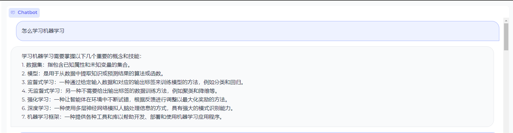
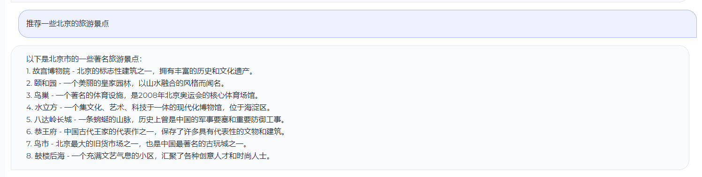
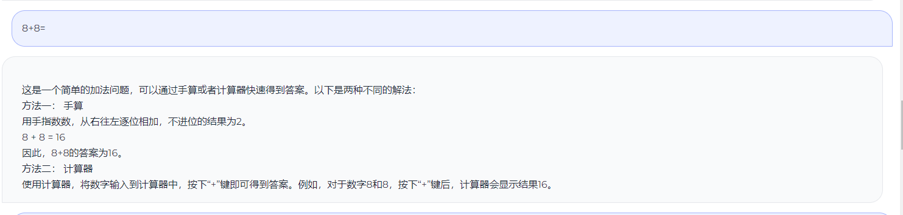

## GoGPT

基于中文指令数据微调BLOOM

> 训练第一轮足够了，后续第二轮和第三轮提升不大

- 🚀多样性指令数据
- 🚀筛选高质量中文数据

| 模型名字       | 参数量    | 模型地址 |
|------------|--------|------|
| gogpt-560m | 5.6亿参数 | 🤗[golaxy/gogpt-560m](https://huggingface.co/golaxy/gogpt-560m) |
| gogpt-3b   | 30亿参数  | 🤗[golaxy/gogpt-3b](https://huggingface.co/golaxy/gogpt-3b) |

## 测试效果

## TODO
- 进行RLFH训练
- 后续加入中英平行语料

## 感谢

- [@hz大佬-zero_nlp](https://github.com/yuanzhoulvpi2017/zero_nlp)
- [stanford_alpaca](https://github.com/tatsu-lab/stanford_alpaca)
- [Belle数据](https://huggingface.co/BelleGroup)