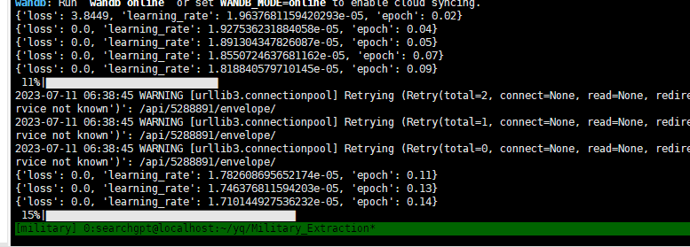

## 模型训练问题记录

-  在gogpt底座微调（sft）阶段，出现学习率为0
学习率慢慢变为0，一开始还是正常的学习预热+衰减，但是到后期（比如迭代2000步）之后，学习率直接变为0了。
```text
gradient_accumulation_steps设置为1

在Github Issues看到也和deepspeed的学习率规划器设置冲突了，去除deepspeed中关于优化器和学习率规划器的设置即可
```


-  在gogpt底座微调（sft）阶段，出现loss为0
